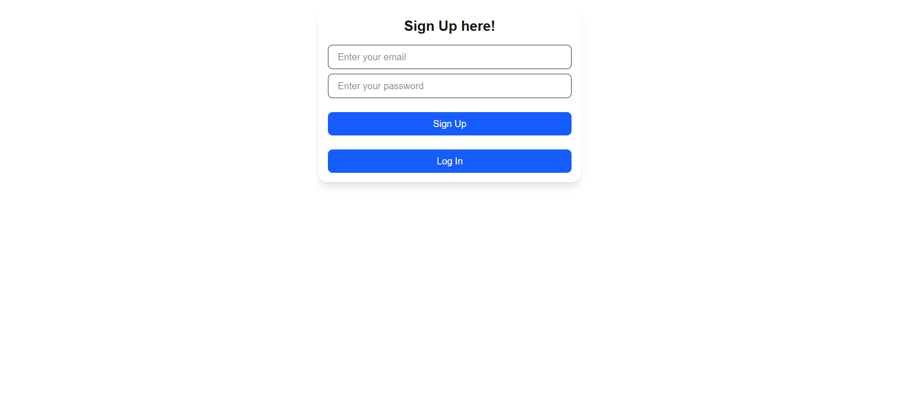
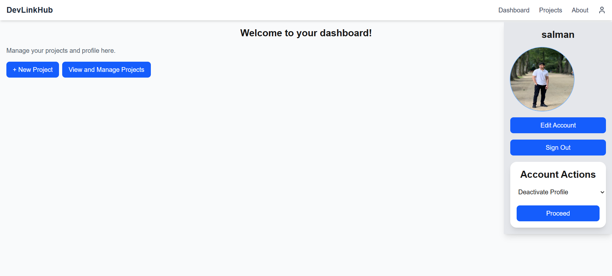
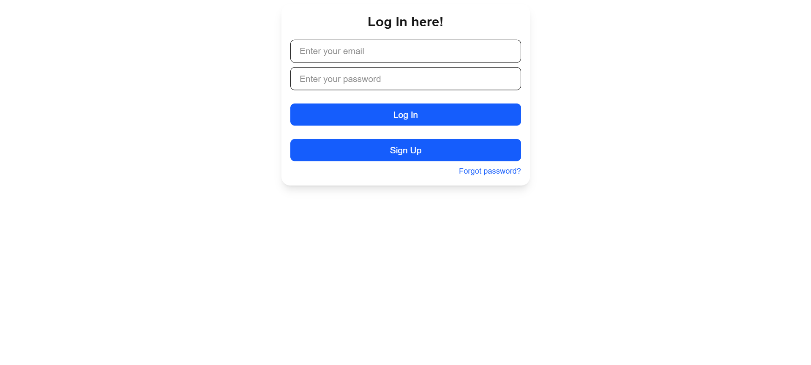

# Smart Project Management

A full-stack collaborative project management app built with **Next.js**, **Supabase**, and **Tailwind CSS**. This app allows users to create, manage, and collaborate on projects with features like authentication, role-based access, and real-time updates.

---

## Features

* 🔐 Email/password authentication with Supabase
* 👤 User profile management with avatar upload
* 📁 Create, edit, delete projects
* 🧑‍🤝‍🧑 Invite collaborators (coming soon)
* 💬 Real-time chat in projects (coming soon)
* 🧩 Modular React component structure
* 📦 Environment-based config

---

## Tech Stack

* **Frontend**: Next.js, React, Tailwind CSS
* **Backend**: Supabase (PostgreSQL + Auth + Storage)
* **Deployment**: Vercel

---

## Folder Structure

```
smart_project_management/
├── components/          # UI Components (ProjectCard, Profile, etc.)
├── pages/               # Next.js Routing (Dashboard, Auth, etc.)
├── styles/              # Tailwind and Global CSS
├── utils/               # Supabase client and helper functions
├── public/              # Static assets (logo, screenshots, etc.)
├── .env.local           # Environment variables
└── README.md
```

---

## Getting Started

Clone the repository:

```bash
git clone https://github.com/Muhammad-Salman696/DevLinkManager.git
cd DevLinkManager
```

Install dependencies:

```bash
npm install
```

Set up environment variables in `.env.local`:

```
NEXT_PUBLIC_SUPABASE_URL=your-supabase-url
NEXT_PUBLIC_SUPABASE_ANON_KEY=your-supabase-anon-key
SUPABASE_SERVICE_ROLE_KEY=your-supabase-service-role-key (needed for server-side ops)
```

Run the development server:

```bash
npm run dev
```

Go to [http://localhost:3000](http://localhost:3000) to view the app.

---

## Deployment (Vercel)

1. Push your code to GitHub
2. Go to [Vercel](https://vercel.com)
3. Import project from GitHub
4. Set environment variables in Vercel Dashboard
5. Click Deploy

Changes to your code will trigger automatic redeployment.

---

## Screenshots

```




```

---

## Roadmap

* [x] Authentication
* [x] Create & view projects
* [ ] Collaborator invitations
* [ ] Real-time chat
* [ ] Voice communication

---

## Acknowledgments

* [Supabase](https://supabase.com)
* [Tailwind CSS](https://tailwindcss.com)
* [Vercel](https://vercel.com)
* [Next.js](https://nextjs.org)

---

> Built with ❤️ by Muhammad Salman
